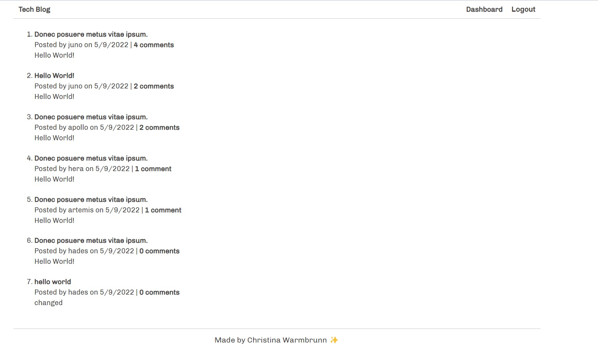

**Project Title:**

Tech Blog

---

**Project Description/Summary:**

Creating a CMS style blog similar to Wordpress, where developers can publish their blog posts and comment on other developer's posts as well. This app follows the MVC paradigm in its architectural structure, using Handlebars.js as the templating language, Sequelize as the ORM, and the express-session npm package for authentication.

---

**Live Site:**

Heroku site is [here](https://tranquil-retreat-22206.herokuapp.com)

---

**Technology Used:**

- JavaScript
- CSS
- Express.js
- Handlebars.js
- Sequelize
- MySQL2
- bcrypt
- dotenv

---

**Installation:**

No installation necessary - head to the Heroku link to interact with the deployed site.

---

**Screenshot**

